# woodwhales-jdk1.8-study

## 说明

JDK 版本：jdk-8u201

本项目存储目录为：D:\code\woodwhales\woodwhales-jdk1.8-source-study

## IDEA 编译环境配置

### 环境配置

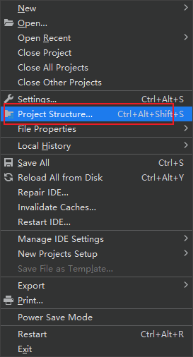

### SDK 配置

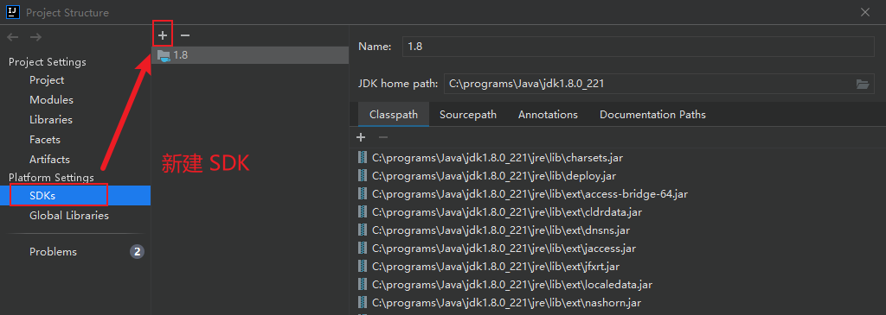

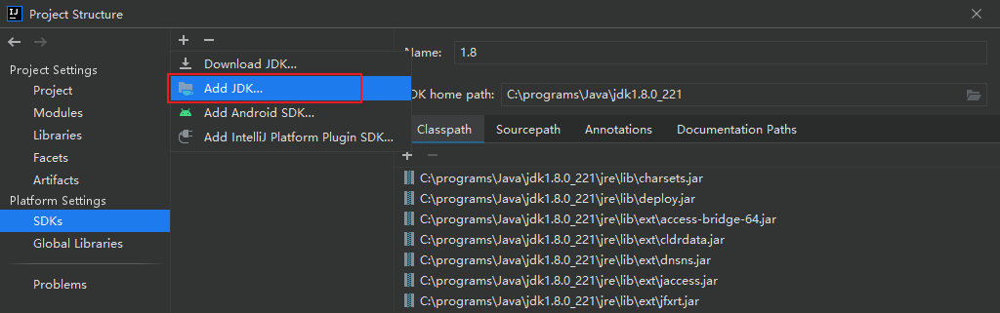

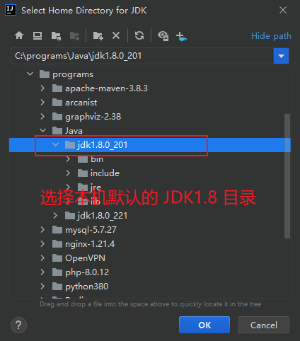

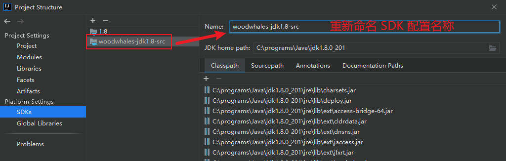

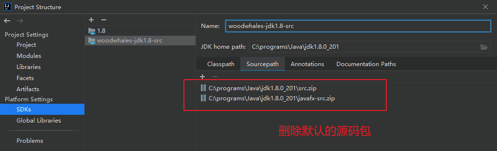

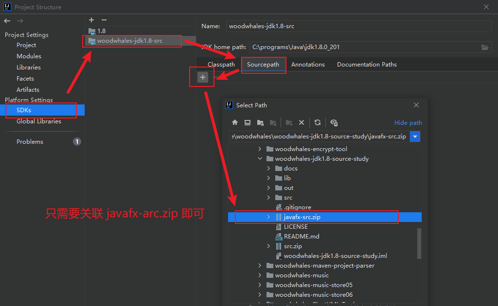

### 工程配置

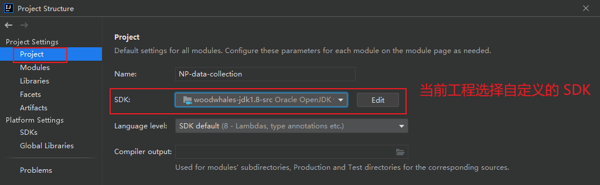

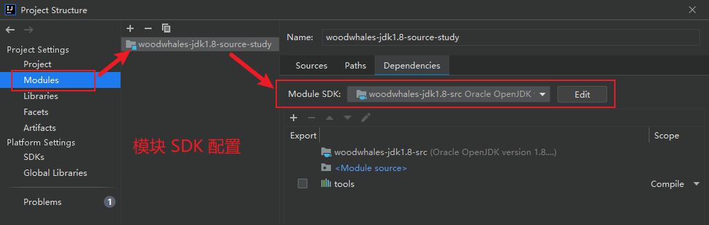

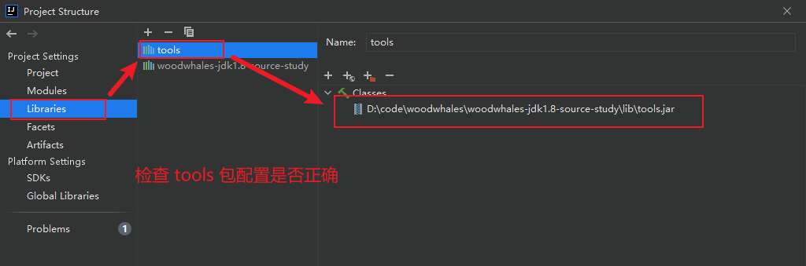

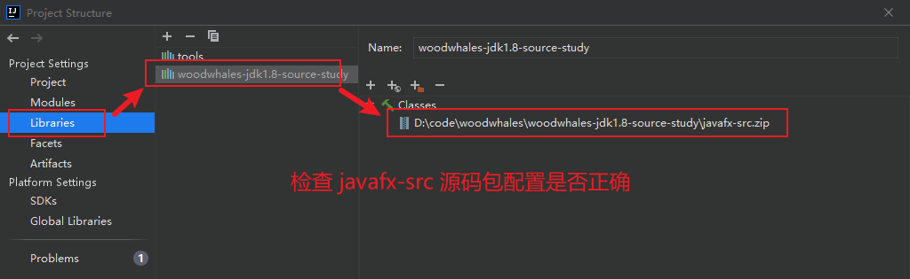

### 其他配置

项目编译过程中可能存在`OutOfMemoryError:insufficient memory`

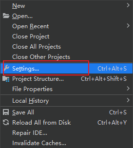

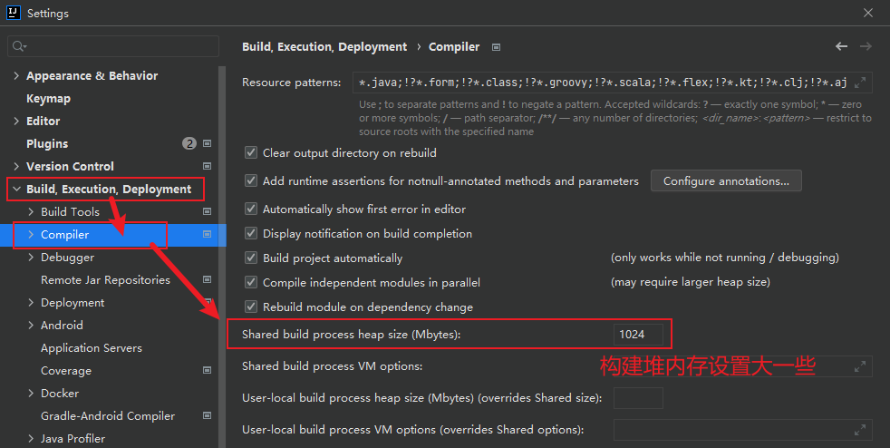

### 单元测试

在 src 目录下创建单元测试：

```java
package test;

/**
 * @author woodwhales on 2022-01-05 11:09
 */
public class Test {

    public static void main(String[] args) {
        System.out.println("woodwhales.cn");
    }

}
```

debug 可知关联的源码为本项目中的源码。

### 参考博文

https://blog.csdn.net/weixin_39520967/article/details/104592232

